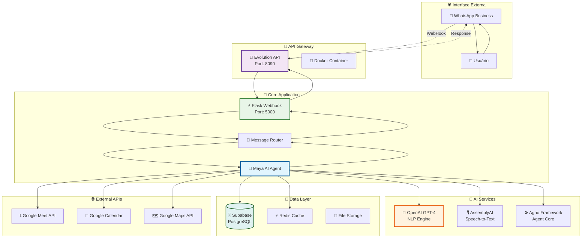
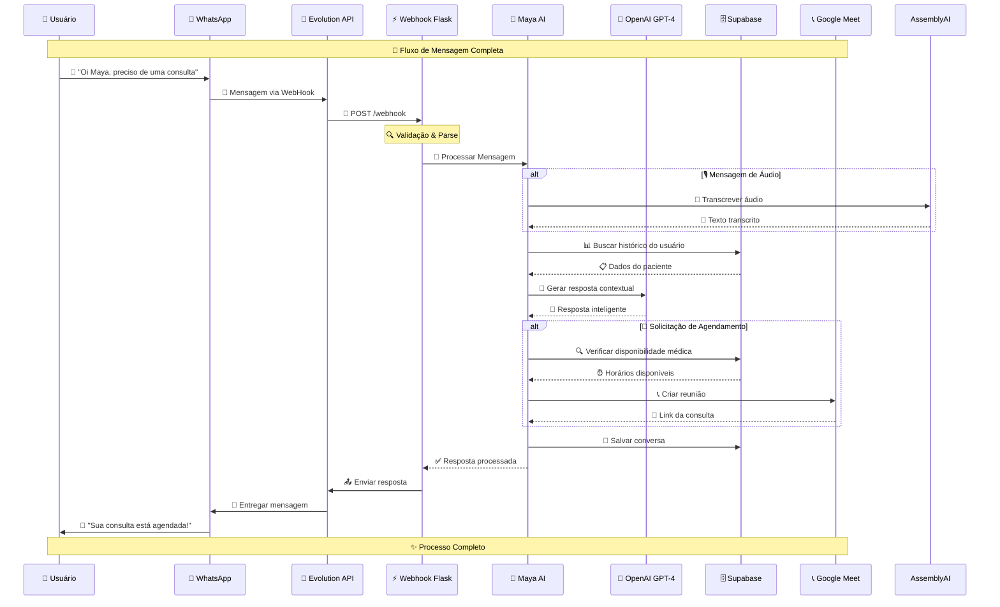
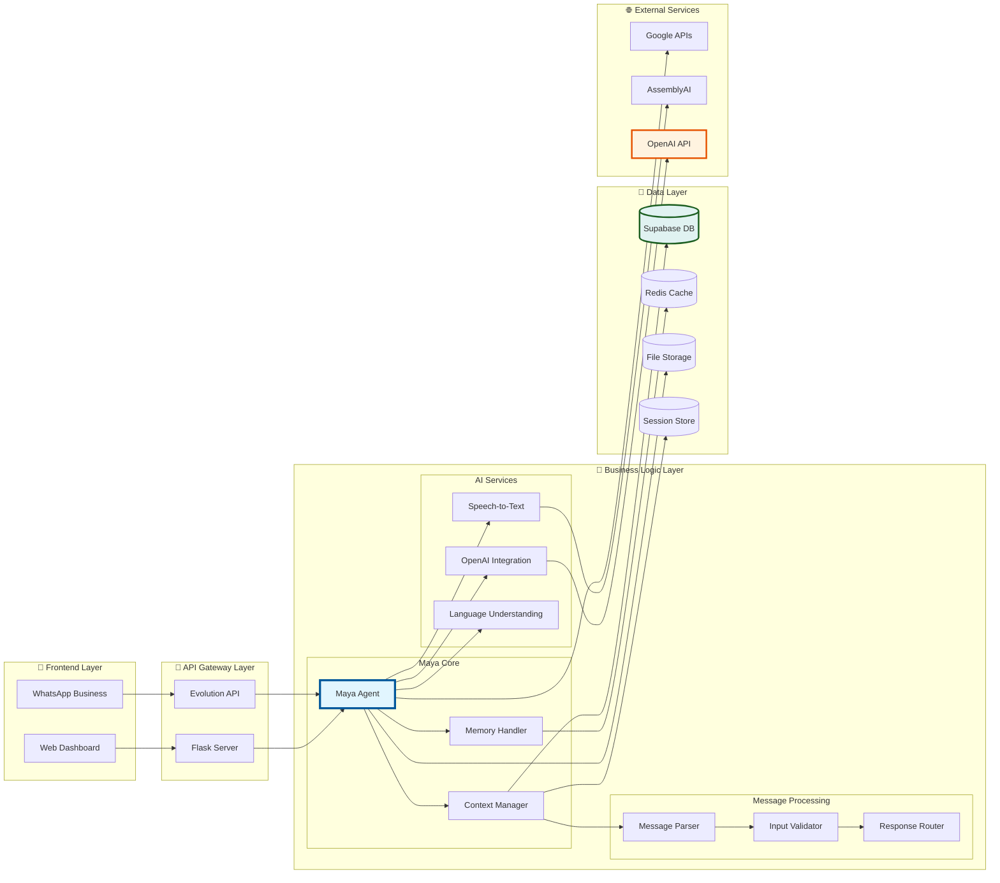
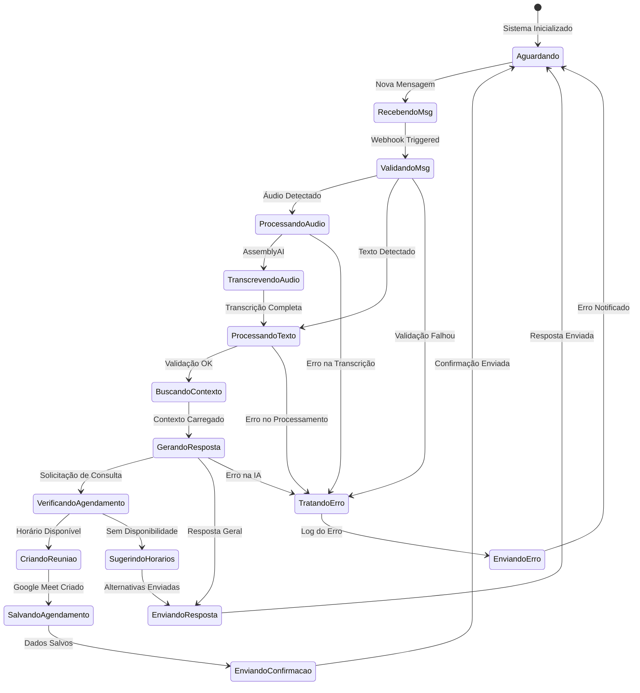
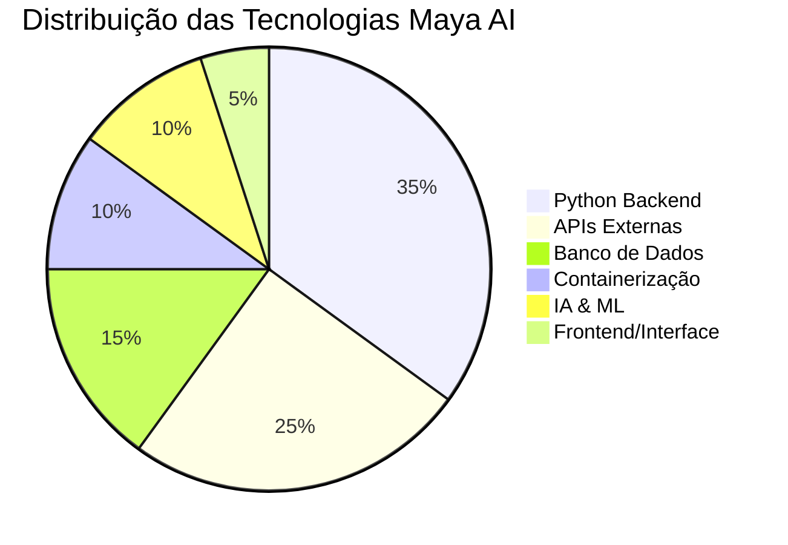
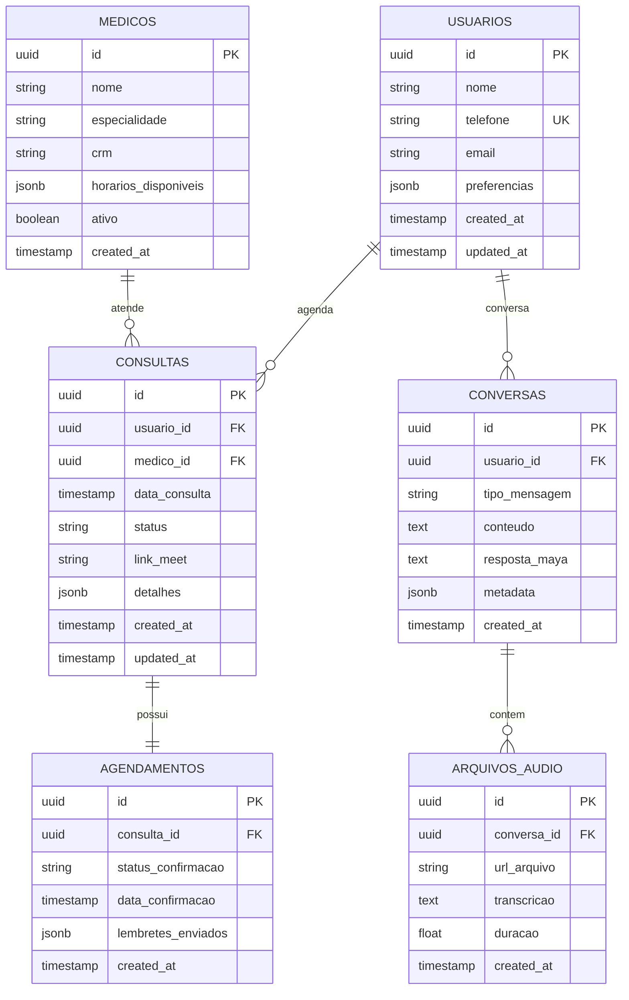
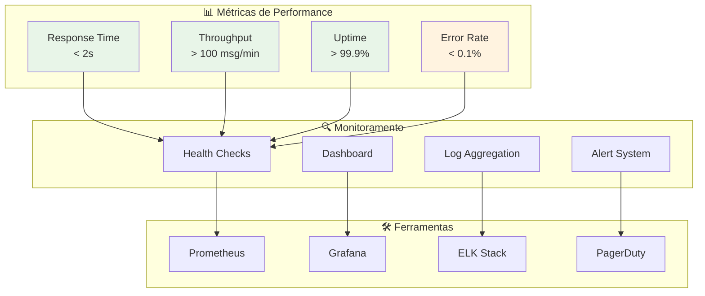
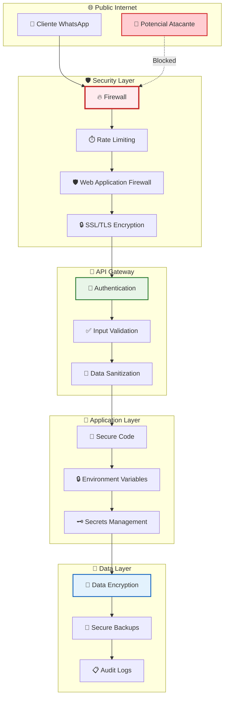
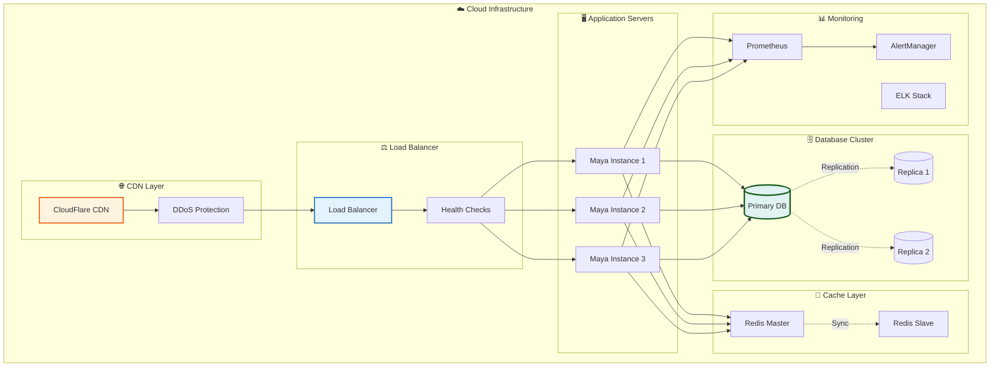

# 🌿 Maya AI - Sistema de Atendimento Virtual

**Maya AI** é um agente inteligente especializado em atendimento via WhatsApp para agendamento de consultas médicas de cannabis medicinal. O sistema integra múltiplas APIs e tecnologias para oferecer uma experiência completa de atendimento automatizado.


## 📁 Estrutura do Projeto (Organizada)

```
mayahope/
├── 📱 Ponto de Entrada
│   ├── app.py                    # Deploy web (Render, Heroku)
│   ├── main.py                   # Servidor FastAPI principal
│   └── README.md                 # Documentação principal
│
├── 🧠 Core da Aplicação (src/)
│   ├── __init__.py              # Configuração do pacote
│   ├── config.py                # Configurações centralizadas
│   │
│   ├── core/                    # Módulos principais
│   │   ├── maya_hopecann.py     # Aplicação Maya completa
│   │   ├── maya_optimized.py    # Versão otimizada
│   │   ├── contact_memory.py    # Gerenciamento de memória
│   │   └── __init__.py
│   │
│   ├── utils/                   # Utilitários
│   │   ├── process_audio.py     # Processamento de áudio
│   │   ├── process_image.py     # Processamento de imagem
│   │   ├── audio.py             # Módulo de áudio
│   │   ├── imagem.py            # Módulo de imagem
│   │   ├── enquete.py           # Sistema de enquetes
│   │   ├── whatsapp_media_decrypt.py  # Decriptação WhatsApp
│   │   └── __init__.py
│   │
│   ├── integrations/            # APIs e Integrações
│   │   ├── evolution_client/    # Cliente Evolution API
│   │   ├── webhook_server/      # Servidor webhook FastAPI
│   │   └── __init__.py
│   │
│   └── agents/                  # Sistema de Agentes
│       ├── agno_core/          # Framework Agno Core
│       ├── agent_whatsapp/     # Agente WhatsApp
│       ├── agent_image/        # Agente de imagem
│       └── agent_poll/         # Agente de enquetes
│
├── ⚙️ Configuração (config/)
│   ├── docker-compose.yml      # Docker para Evolution API
│   ├── render.yaml            # Configuração Render
│   └── supabase_schema.sql    # Schema do banco
│
├── 🛠️ Scripts (scripts/)
│   ├── setup_*.py             # Scripts de inicialização
│   ├── create_*.py            # Scripts de criação
│   └── configurar_webhook.py  # Configuração webhook
│
├── 📚 Documentação (docs/)
│   ├── EVOLUTION_API_CONFIG.md # Configuração Evolution API
│   ├── GUIA_MAYA_HOPECANN.md  # Guia de uso
│   ├── README_DEPLOY.md       # Guia de deploy
│   ├── README_SCRIPTS.md      # Documentação scripts
│   └── WEBHOOK_FASTAPI.md     # Documentação webhook
│
├── 🔧 Arquivos de Sistema
│   ├── requirements.txt       # Dependências Python
│   ├── Dockerfile            # Container Docker
│   ├── .env / .env.maya      # Variáveis de ambiente
│   ├── .gitignore            # Arquivos ignorados Git
│   └── .dockerignore         # Arquivos ignorados Docker
│
├── 🚀 Scripts Windows
│   ├── iniciar_maya.bat      # Iniciar sistema
│   ├── parar_maya.bat        # Parar sistema
│   ├── status_maya.bat       # Verificar status
│   └── reconectar_whatsapp.bat # Reconectar WhatsApp
│
└── 🤖 WhatsApp Agent
    └── whatsapp-agent/        # Sistema modular WhatsApp
```

## ✨ Melhorias na Organização

### 🎯 **Separação clara de responsabilidades**
- **`src/core/`** - Lógica principal da Maya
- **`src/utils/`** - Ferramentas auxiliares
- **`src/integrations/`** - APIs externas
- **`src/agents/`** - Sistema de agentes

### 📦 **Estrutura de pacotes Python**
- Arquivos `__init__.py` em todos os diretórios
- Importações organizadas e centralizadas
- Configuração centralizada em `src/config.py`

### 🔧 **Dependências atualizadas**
- **FastAPI** adicionado para APIs modernas
- **Uvicorn** para servidor ASGI
- **Pycryptodome** para criptografia
- **Structlog** para logging estruturado

## 📊 Arquitetura do Sistema

### 🏗️ Visão Geral da Arquitetura



### 🔄 Fluxo de Processamento de Mensagens



### 🛠️ Arquitetura de Componentes



### 🔄 Ciclo de Vida da Sessão



## 🚀 Características Principais

### 🤖 Agente Inteligente
- **Processamento de Linguagem Natural** com OpenAI GPT-4
- **Contexto Conversacional** mantido durante toda a sessão
- **Respostas Personalizadas** baseadas no histórico do paciente
- **Multimodal**: Suporte a texto, áudio e imagens

### 📱 Integração WhatsApp
- **Evolution API** para comunicação bidirecional
- **Webhook em tempo real** para processamento instantâneo
- **Suporte a mídia** (áudio, imagem, documentos)
- **Status de entrega** e confirmação de leitura

### 📅 Sistema de Agendamento
- **Integração Supabase** para persistência de dados
- **Google Meet** para criação automática de consultas
- **Verificação de disponibilidade** médica em tempo real
- **Notificações automáticas** de confirmação

### 🎵 Processamento de Áudio
- **Transcrição automática** via AssemblyAI
- **Suporte a múltiplos formatos** de áudio
- **Conversão de voz para texto** em português brasileiro

## 📁 Estrutura do Projeto

```
mayahope/
├── 🚀 Scripts de Inicialização
│   ├── iniciar_maya.bat          # Script principal de inicialização
│   ├── parar_maya.bat            # Script para parar o sistema
│   ├── status_maya.bat           # Script de verificação de status
│   └── reconectar_whatsapp.bat   # Script para reconectar WhatsApp
│
├── 🧠 Core da Aplicação
│   ├── webhook_flask.py          # Servidor webhook principal
│   ├── maya_optimized.py         # Agente Maya otimizado
│   └── maya_hopecann.py          # Implementação completa Maya
│
├── 📱 Integração APIs
│   ├── evolution_client/         # Cliente Evolution API
│   │   ├── simple_client.py      # Cliente simplificado
│   │   └── config.py            # Configurações da API
│   └── configurar_webhook.py     # Script de configuração webhook
│
├── 🤖 Sistema de Agentes
│   └── agents/
│       └── agno_core/           # Framework Agno Core
│           └── agno_core/
│               ├── interfaces.py # Interfaces do sistema
│               └── orchestrator.py # Orquestrador de agentes
│
├── 🗄️ Banco de Dados
│   ├── setup_supabase_tables.py # Setup das tabelas Supabase
│   └── inspect_supabase_schema.py # Inspeção do schema
│
├── ⚙️ Configuração
│   ├── .env                     # Variáveis de ambiente
│   ├── requirements.txt         # Dependências Python
│   └── docker-compose.yml       # Docker Compose Evolution API
│
└── 📚 Documentação
    ├── README.md               # Este arquivo
    └── README_SCRIPTS.md       # Documentação dos scripts
```

## 🛠️ Instalação

### Pré-requisitos
- **Python 3.8+**
- **Docker & Docker Compose**
- **Git**

### 1. Clonar o Repositório
```bash
git clone https://github.com/deveclipsy007/maya.git
cd maya
```

### 2. Instalar Dependências
```bash
pip install -r requirements.txt
```

### 3. Configurar Variáveis de Ambiente
```bash
cp .env.example .env
# Edite o arquivo .env com suas credenciais
```

#### Variáveis Obrigatórias:
```env
# Evolution API
EVOLUTION_API_URL=http://localhost:8090
EVOLUTION_API_KEY=1234
EVOLUTION_INSTANCE_NAME=agente_bot

# OpenAI
OPENAI_API_KEY=sua_chave_openai

# Supabase
SUPABASE_URL=sua_url_supabase
SUPABASE_KEY=sua_chave_supabase

# AssemblyAI (para transcrição de áudio)
ASSEMBLY_AI_API_KEY=sua_chave_assemblyai
```

### 4. Configurar Banco de Dados
```bash
python setup_supabase_tables.py
```

## 🚀 Como Executar

### Método 1: Script Automatizado (Recomendado)
```bash
# Windows
.\iniciar_maya.bat

# Linux/Mac
chmod +x iniciar_maya.sh && ./iniciar_maya.sh
```

### Método 2: Manual
```bash
# 1. Iniciar Evolution API
docker-compose up -d

# 2. Aguardar inicialização (30 segundos)

# 3. Configurar webhook
python configurar_webhook.py

# 4. Iniciar Maya
python webhook_flask.py
```

### 3. Conectar WhatsApp
1. Acesse http://localhost:8090
2. Vá para a seção "Instance"
3. Encontre a instância `agente_bot`
4. Clique em "Connect" para gerar QR Code
5. Escaneie o QR Code com seu WhatsApp

## 📋 Uso

### Comandos Básicos
- **Iniciar sistema**: `iniciar_maya.bat`
- **Verificar status**: `status_maya.bat` 
- **Parar sistema**: `parar_maya.bat`
- **Reconectar WhatsApp**: `reconectar_whatsapp.bat`

### Monitoramento
- **Evolution API**: http://localhost:8090
- **Servidor Maya**: http://localhost:5000
- **Health Check**: http://localhost:5000/health
- **Mensagens**: http://localhost:5000/mensagens

### Funcionalidades da Maya
- 🌿 **Consultas sobre cannabis medicinal**
- 📅 **Agendamento de consultas médicas**
- 💬 **Conversas inteligentes com contexto**
- 🎵 **Transcrição de mensagens de áudio**
- 📋 **Informações sobre tratamentos**
- 🔍 **Busca de informações médicas atualizadas**

## 🔧 Stack Tecnológica

| Componente | Tecnologia | Versão | Função |
|------------|------------|---------|---------|
| **Backend** | Python | 3.8+ | Linguagem principal |
| **Web Framework** | Flask | 2.2.3 | Servidor webhook |
| **IA** | OpenAI GPT-4 | 1.3.0 | Processamento de linguagem |
| **WhatsApp** | Evolution API | v1.8.2 | Integração WhatsApp |
| **Banco de Dados** | Supabase | 2.0.0 | Persistência de dados |
| **Áudio** | AssemblyAI | 0.17.0 | Transcrição de áudio |
| **Reuniões** | Google Meet API | 2.100.0 | Criação de consultas |
| **Container** | Docker | Latest | Isolamento de serviços |

### 📊 Distribuição de Tecnologias



### 🗄️ Modelo de Dados



### 🚀 Pipeline de Deploy

```mermaid
gitgraph
    commit id: "Desenvolvimento Local"
    branch feature/nova-funcionalidade
    checkout feature/nova-funcionalidade
    commit id: "Implementação"
    commit id: "Testes Unitários"
    commit id: "Testes Integração"
    
    checkout main
    merge feature/nova-funcionalidade
    commit id: "Merge Aprovado"
    
    branch staging
    checkout staging
    commit id: "Deploy Staging"
    commit id: "Testes E2E"
    commit id: "Validação QA"
    
    checkout main
    merge staging
    commit id: "Release Candidate"
    
    branch production
    checkout production
    commit id: "Deploy Production"
    commit id: "Monitor Health"
    commit id: "Release Complete"
```

### ⚡ Performance & Monitoramento



## 🔐 Segurança

- ✅ **Variáveis de ambiente** para todas as credenciais
- ✅ **Validação robusta** de entrada de dados
- ✅ **Logs sem informações pessoais** sensíveis
- ✅ **Arquivos sensíveis** no `.gitignore`
- ✅ **Comunicação HTTPS** em produção
- ✅ **Rate limiting** para prevenção de spam

### 🛡️ Arquitetura de Segurança



### 🏗️ Infraestrutura Cloud



## 📈 Monitoramento e Logs

### Health Checks
```bash
# Verificar saúde do sistema
curl http://localhost:5000/health

# Verificar Evolution API
curl http://localhost:8090

# Status completo
.\status_maya.bat
```

### Logs em Tempo Real
```bash
# Logs da Maya
tail -f logs/maya.log

# Logs do webhook
tail -f logs/webhook.log

# Logs do Docker
docker logs evolution-api
```

## 🧪 Testes

### Teste Manual
```bash
# Enviar mensagem de teste
curl -X POST http://localhost:5000/webhook \
  -H "Content-Type: application/json" \
  -d '{"event":"MESSAGES_UPSERT","data":{"message":{"conversation":"Oi Maya"}}}'
```

### Teste Completo
```bash
python test_maya.py
```

## 🚀 Deploy

### Docker
```bash
# Build da imagem
docker build -t maya-ai .

# Executar container
docker run -p 5000:5000 --env-file .env maya-ai
```

### Render/Heroku
```bash
# Deploy automático via git
git push render main
```

## 🤝 Contribuição

1. **Fork** o projeto
2. **Clone** seu fork: `git clone https://github.com/SEU_USUARIO/maya.git`
3. **Crie** uma branch: `git checkout -b feature/nova-funcionalidade`
4. **Commit** suas mudanças: `git commit -m 'Adiciona nova funcionalidade'`
5. **Push** para a branch: `git push origin feature/nova-funcionalidade`
6. **Abra** um Pull Request

### Diretrizes de Contribuição
- Mantenha o código limpo e bem documentado
- Adicione testes para novas funcionalidades
- Siga as convenções de nomenclatura existentes
- Atualize a documentação quando necessário

## 📄 Licença

Este projeto está licenciado sob a **MIT License** - veja o arquivo [LICENSE](LICENSE) para detalhes.

## 🆘 Suporte

### Problemas Comuns

**Maya não responde às mensagens**
```bash
# Verificar status
.\status_maya.bat

# Verificar logs
cat logs/maya.log

# Reiniciar sistema
.\parar_maya.bat && .\iniciar_maya.bat
```

**WhatsApp desconectado**
```bash
# Reconectar WhatsApp
.\reconectar_whatsapp.bat
```

**Evolution API não inicia**
```bash
# Verificar Docker
docker ps

# Reiniciar Evolution API
docker-compose restart
```

### Contato
- **Issues**: [GitHub Issues](https://github.com/deveclipsy007/maya/issues)
- **Discussões**: [GitHub Discussions](https://github.com/deveclipsy007/maya/discussions)
- **Email**: dev@hopecann.com

---

<div align="center">

**🌿 Maya AI - Democratizando o acesso à cannabis medicinal através da tecnologia 🤖**

[⭐ Star este projeto](https://github.com/deveclipsy007/maya) • [🐛 Reportar Bug](https://github.com/deveclipsy007/maya/issues) • [💡 Sugerir Feature](https://github.com/deveclipsy007/maya/issues)

</div>

## ✨ Funcionalidades Principais

🎙️ **Transcrição de Áudio** - Converte áudios WhatsApp em texto usando OpenAI Whisper  
🤖 **IA Conversacional** - Respostas naturais e inteligentes com Agno Framework  
📅 **Agendamento Inteligente** - Agenda consultas automaticamente  
🎥 **Google Meet** - Cria reuniões automáticas para consultas  
💾 **Memória Persistente** - Lembra conversas e preferências dos pacientes  
🔗 **Integração Completa** - Supabase, OpenAI, Evolution API, Google Calendar  

## 🚀 Deploy Web

### Render (Recomendado)

1. **Fork este repositório**
2. **Configure no [Render](https://render.com):**
   - Build Command: `pip install -r requirements.txt`
   - Start Command: `gunicorn app:app`
   - Environment: Python 3

3. **Variáveis de Ambiente:**
```env
OPENAI_API_KEY=sk-...
EVOLUTION_API_URL=https://sua-evolution-api.com
EVOLUTION_API_KEY=sua-chave
EVOLUTION_INSTANCE_NAME=maya-bot
SUPABASE_URL=https://projeto.supabase.co
SUPABASE_KEY=sua-chave
```

## 🛠️ Desenvolvimento Local

```bash
# 1. Clone o repositório
git clone https://github.com/deveclipsy007/maya.git
cd maya

# 2. Instale dependências
pip install -r requirements.txt

# 3. Configure .env
cp .env.example .env
# Edite .env com suas chaves

# 4. Execute
python maya_hopecann.py
```

## 📡 API Endpoints

- `POST /webhook` - Recebe mensagens WhatsApp
- `GET /health` - Status do sistema
- `GET /agendamentos` - Lista agendamentos
- `GET /medicos` - Lista médicos disponíveis

## 🏗️ Arquitetura

```
├── app.py                 # 🚀 Ponto de entrada (deploy)
├── maya_hopecann.py       # 🧠 Aplicação principal
├── requirements.txt       # 📦 Dependências
├── render.yaml           # ⚙️ Configuração Render
├── agents/               # 🤖 Agentes especializados
├── evolution_client/     # 📱 Cliente Evolution API
└── webhook_server/       # 🔗 Servidor de webhooks
```

## 🔐 Segurança

- ✅ Variáveis de ambiente para credenciais
- ✅ Arquivos sensíveis no `.gitignore`
- ✅ Validação robusta de entrada
- ✅ Logs sem informações pessoais

## 📖 Documentação

- [README_DEPLOY.md](README_DEPLOY.md) - Guia completo de deploy
- [GUIA_MAYA_HOPECANN.md](GUIA_MAYA_HOPECANN.md) - Documentação técnica
- [EVOLUTION_API_CONFIG.md](EVOLUTION_API_CONFIG.md) - Configuração Evolution API

---

**Maya HopeCann** - Transformando o atendimento médico com IA 🌿
python -m venv .venv
python app.py
```

## 💬 Como Usar

### Envio Programático
```python
from core import WhatsAppClient

client = WhatsAppClient()
client.send_message("5511999999999", "Olá! Como posso ajudar?")
```

### Respostas Personalizadas
```python
from core import ResponseGenerator

# Cria gerador personalizado
response_gen = ResponseGenerator()

# Adiciona padrões customizados
response_gen.add_custom_pattern(
    category="vendas",
    patterns=["preço", "valor", "quanto custa"],
    responses=["Entre em contato com nossa equipe comercial! 💰"]
)
```

### API REST
```bash
# Enviar mensagem via API
curl -X POST http://localhost:5000/send \
  -H "Content-Type: application/json" \
  -d '{"number": "5511999999999", "message": "Sua mensagem"}'

# Verificar status
curl http://localhost:5000/status
```

## 🔧 Endpoints da API

| Endpoint | Método | Descrição |
|----------|--------|-----------|
| `/` | GET | Informações da API |
| `/status` | GET | Status do agente |
| `/send` | POST | Enviar mensagem |
| `/webhook` | POST | Receber mensagens (Evolution API) |

## 🤖 Respostas Inteligentes

O agente responde automaticamente para:

- **Saudações**: "oi", "olá", "bom dia" → Mensagens de boas-vindas
- **Despedidas**: "tchau", "até logo" → Mensagens de despedida  
- **Agradecimentos**: "obrigado", "valeu" → Mensagens de cortesia
- **Ajuda**: "ajuda", "help" → Lista de funcionalidades
- **Sobre**: "quem é você", "bot" → Informações do agente
- **Outras**: Resposta personalizada com eco da mensagem

## 🔌 Integração em Outros Projetos

### Opção 1: Copiar Módulos Core
```bash
# Copie a pasta core/ para seu projeto
cp -r whatsapp-agent/core/ seu-projeto/
```

### Opção 2: Usar como Submódulo
```bash
# Adicione como submódulo Git
git submodule add https://github.com/seu-repo/whatsapp-agent.git
```

### Opção 3: Importar Diretamente
```python
# No seu projeto
import sys
sys.path.append('caminho/para/whatsapp-agent')

from core import WhatsAppClient, MessageHandler, ResponseGenerator
```

## ⚙️ Configuração (.env)

```env
EVOLUTION_API_URL=http://localhost:8080
INSTANCE_NAME=agente_bot
API_KEY=1234
```

## 📚 Exemplos Práticos

### Bot de Vendas
```python
from core import ResponseGenerator

sales_bot = ResponseGenerator()
sales_bot.add_custom_pattern(
    "produtos",
    ["produto", "catálogo", "o que vocês vendem"],
    ["Temos diversos produtos! Acesse nosso catálogo: link.com 🛒"]
)
```

### Bot de Suporte
```python
support_bot = ResponseGenerator()
support_bot.add_custom_pattern(
    "suporte",
    ["problema", "erro", "não funciona"],
    ["Vou te ajudar! Descreva o problema detalhadamente 🔧"]
)
```

## 🐳 Docker

```bash
# Iniciar Evolution API
docker-compose up -d

# Parar serviços  
docker-compose down

# Ver logs
docker-compose logs -f evolution-api
```

## 🔍 Monitoramento

Logs estruturados mostram:
- 📨 Mensagens recebidas
- 🤖 Respostas geradas  
- ✅ Envios bem-sucedidos
- ❌ Erros e falhas

## � Troubleshooting

### Evolution API não responde
```bash
# Verificar se está rodando
docker ps | grep evolution

# Verificar logs
docker logs evolution-api
```

### Webhook não funciona
1. Verifique se o agente está rodando na porta 5000
2. Confirme se o WhatsApp está conectado
3. Verifique os logs do agente

## 🎯 Casos de Uso

- ✅ **Atendimento automatizado**
- ✅ **Notificações de sistema**  
- ✅ **Bot de vendas**
- ✅ **Suporte técnico**
- ✅ **Campanhas de marketing**
- ✅ **Integração com CRM**

## 🔄 Próximas Versões

- [ ] Interface web de gerenciamento
- [ ] Integração com IA (GPT, Claude)
- [ ] Suporte a mídias (imagens, áudios)
- [ ] Banco de dados para histórico
- [ ] Agendamento de mensagens
- [ ] Métricas e analytics

---

**🎉 Sistema modular pronto para produção!**

=======
# maya
>>>>>>> 7e84ea569a577f9f9f6f3053d34f6ada10123d05
